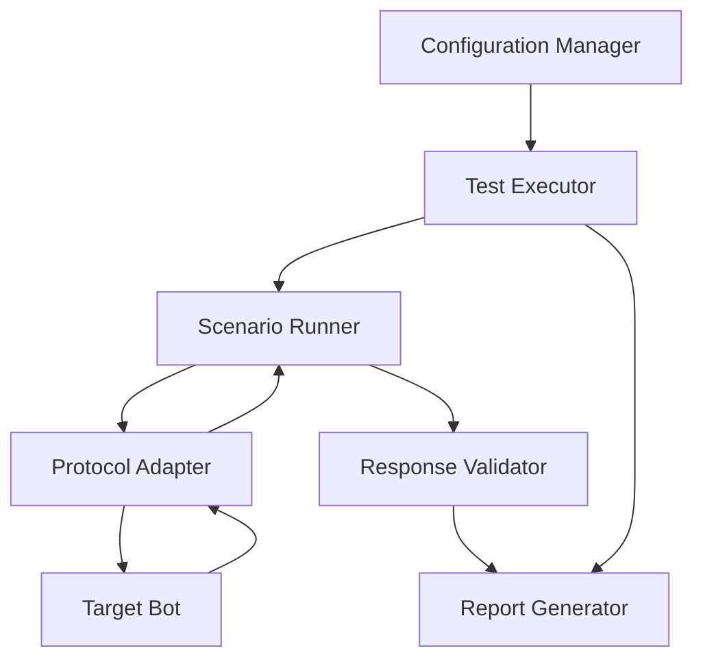

# Design Document: Patience Chat Bot Testing System

## Overview

Patience is a chat bot testing framework that automates the validation of conversational AI systems. The architecture follows a modular design with clear separation between test execution, communication protocols, validation logic, and reporting. The system supports both scripted test scenarios and generative testing approaches, enabling comprehensive validation of Target Bot behavior.

## Architecture

The system follows a layered architecture:

1. **Configuration Layer**: Loads and validates test scenarios, bot connection details, and validation rules
2. **Execution Layer**: Orchestrates test sessions and manages conversation flow
3. **Communication Layer**: Handles protocol-specific interactions with Target Bots
4. **Validation Layer**: Evaluates Target Bot responses against expected criteria
5. **Reporting Layer**: Generates test reports and aggregates results

### High-Level Component Diagram



## Components and Interfaces

### Configuration Manager

**Responsibility**: Load, parse, and validate configuration files and test scenarios

**Interface**:
```typescript
interface ConfigurationManager {
  loadConfig(filePath: string): Promise<TestConfig>
  validateConfig(config: TestConfig): ValidationResult
  loadScenarios(scenarioPath: string): Promise<Scenario[]>
}

interface TestConfig {
  targetBot: BotConfig
  scenarios: Scenario[]
  validation: ValidationConfig
  timing: TimingConfig
  reporting: ReportConfig
}
```

### Test Executor

**Responsibility**: Orchestrate test execution across multiple scenarios and sessions

**Interface**:
```typescript
interface TestExecutor {
  executeTests(config: TestConfig): Promise<TestResults>
  executeScenario(scenario: Scenario): Promise<ScenarioResult>
  handleTestFailure(error: Error, context: TestContext): void
}
```

### Scenario Runner

**Responsibility**: Execute individual conversation scenarios step-by-step

**Interface**:
```typescript
interface ScenarioRunner {
  runScenario(scenario: Scenario, adapter: ProtocolAdapter): Promise<ConversationHistory>
  executeStep(step: ConversationStep): Promise<BotResponse>
  handleConditionalBranch(condition: Condition, response: BotResponse): ConversationStep
}

interface Scenario {
  id: string
  name: string
  steps: ConversationStep[]
  expectedOutcomes: ValidationCriteria[]
}

interface ConversationStep {
  message: string | MessageGenerator
  expectedResponse?: ResponseCriteria
  conditionalBranches?: ConditionalBranch[]
  delay?: number
}
```

### Protocol Adapter

**Responsibility**: Abstract communication protocol details and provide unified interface

**Interface**:
```typescript
interface ProtocolAdapter {
  connect(config: BotConfig): Promise<void>
  sendMessage(message: string): Promise<BotResponse>
  disconnect(): Promise<void>
  isConnected(): boolean
}

interface HTTPAdapter extends ProtocolAdapter {
  // HTTP-specific implementation
}

interface WebSocketAdapter extends ProtocolAdapter {
  // WebSocket-specific implementation
}
```

### Response Validator

**Responsibility**: Evaluate Target Bot responses against expected criteria

**Interface**:
```typescript
interface ResponseValidator {
  validate(response: BotResponse, criteria: ValidationCriteria): ValidationResult
  validateExactMatch(response: string, expected: string): boolean
  validatePatternMatch(response: string, pattern: RegExp): boolean
  validateSemanticSimilarity(response: string, expected: string, threshold: number): boolean
}

interface ValidationCriteria {
  type: 'exact' | 'pattern' | 'semantic' | 'custom'
  expected: string | RegExp | CustomValidator
  threshold?: number
}
```

### Message Generator

**Responsibility**: Generate varied test inputs including edge cases

**Interface**:
```typescript
interface MessageGenerator {
  generateMessage(type: MessageType, constraints?: GenerationConstraints): string
  generateEdgeCases(): string[]
  generateSequence(count: number, coherent: boolean): string[]
}

interface GenerationConstraints {
  minLength?: number
  maxLength?: number
  includeSpecialChars?: boolean
  messageType?: 'question' | 'statement' | 'command'
}
```

### Report Generator

**Responsibility**: Create test reports with pass/fail statistics and detailed results

**Interface**:
```typescript
interface ReportGenerator {
  generateReport(results: TestResults): TestReport
  aggregateResults(results: TestResults[]): SummaryReport
  formatReport(report: TestReport, format: 'json' | 'html' | 'markdown'): string
}

interface TestReport {
  timestamp: Date
  totalScenarios: number
  passedScenarios: number
  failedScenarios: number
  scenarioResults: ScenarioResult[]
  summary: string
}
```

## Data Models

### Core Data Structures

```typescript
interface BotResponse {
  content: string | object
  timestamp: Date
  metadata?: Record<string, any>
  error?: Error
}

interface ConversationHistory {
  sessionId: string
  messages: ConversationMessage[]
  startTime: Date
  endTime: Date
}

interface ConversationMessage {
  sender: 'patience' | 'target'
  content: string
  timestamp: Date
  validationResult?: ValidationResult
}

interface ValidationResult {
  passed: boolean
  expected?: string
  actual: string
  message?: string
  details?: Record<string, any>
}

interface ScenarioResult {
  scenarioId: string
  scenarioName: string
  passed: boolean
  conversationHistory: ConversationHistory
  validationResults: ValidationResult[]
  duration: number
  error?: Error
}

interface TestResults {
  testRunId: string
  startTime: Date
  endTime: Date
  scenarioResults: ScenarioResult[]
  summary: {
    total: number
    passed: number
    failed: number
  }
}
```

## Correctness Properties

*A property is a characteristic or behavior that should hold true across all valid executions of a system-essentially, a formal statement about what the system should do. Properties serve as the bridge between human-readable specifications and machine-verifiable correctness guarantees.*

### Acceptance Criteria Testing Prework

### Property 1: Session initialization sends first message
*For any* test session configuration, when the session begins, Patience should send an initial message to the Target Bot before receiving any responses.
**Validates: Requirements 1.1**

### Property 2: Response storage completeness
*For any* Target Bot response, after Patience receives and processes it, the response content should be retrievable from storage.
**Validates: Requirements 1.2**

### Property 3: Session isolation
*For any* sequence of multiple test sessions, state modifications in one session should not affect the initial state or execution of subsequent sessions.
**Validates: Requirements 1.3**

### Property 4: Conversation history completeness
*For any* completed conversation session, the recorded history should contain all messages sent by both Patience and the Target Bot in chronological order.
**Validates: Requirements 1.4**

### Property 5: Scenario parsing round trip
*For any* valid scenario definition, serializing it to the storage format and then parsing it back should produce an equivalent scenario structure.
**Validates: Requirements 2.1**

### Property 6: Step execution advances state
*For any* conversation scenario with multiple steps, after executing a step and receiving a response, the scenario runner should be positioned at the next step.
**Validates: Requirements 2.2, 2.3**

### Property 7: Conditional branch selection correctness
*For any* scenario with conditional branches, the selected branch should match the condition that evaluates to true based on the Target Bot response.
**Validates: Requirements 2.4**

### Property 8: Scenario completion reporting accuracy
*For any* completed scenario, the reported success status should be true if and only if all steps executed without errors and all validations passed.
**Validates: Requirements 2.5**

### Property 9: Message generation diversity
*For any* sequence of N randomly generated messages (where N > 1), at least two messages should differ in either length or content.
**Validates: Requirements 3.1**

### Property 10: Message type appropriateness
*For any* specified message type, generated messages should contain characteristics appropriate to that type (e.g., questions end with question marks, commands use imperative verbs).
**Validates: Requirements 3.3**

### Property 11: Sequential message coherence
*For any* sequence of generated messages with coherence enabled, consecutive messages should maintain topic consistency or contain referential links.
**Validates: Requirements 3.4**

### Property 12: Validation execution completeness
*For any* Target Bot response with associated validation criteria, Patience should execute the validation and produce a result indicating pass or fail.
**Validates: Requirements 4.1**

### Property 13: Validation failure recording
*For any* validation that fails, the recorded result should include both the expected value and the actual value received.
**Validates: Requirements 4.2, 4.3**

### Property 14: Multi-type validation support
*For any* validation type (exact match, pattern match, semantic similarity), Patience should correctly evaluate responses according to that validation type's rules.
**Validates: Requirements 4.4**

### Property 15: Structured data parsing round trip
*For any* valid structured data response from the Target Bot, parsing the data and then serializing it back should produce equivalent structured data.
**Validates: Requirements 5.2**

### Property 16: Error response handling continuity
*For any* test scenario where the Target Bot returns an error response, Patience should capture the error details and continue executing subsequent test steps.
**Validates: Requirements 5.3**

### Property 17: Parse failure detection
*For any* response that cannot be parsed according to the expected format, Patience should mark the interaction as failed and log a parsing error.
**Validates: Requirements 5.4**

### Property 18: Report completeness
*For any* completed test session, the generated report should contain entries for all executed scenarios and all conversation interactions within those scenarios.
**Validates: Requirements 6.1, 6.2**

### Property 19: Report accuracy for failures
*For any* test report containing validation failures, each failure entry should include both the expected response criteria and the actual response received.
**Validates: Requirements 6.3**

### Property 20: Multi-session aggregation correctness
*For any* set of test session results, the aggregated summary should have total counts equal to the sum of individual session counts.
**Validates: Requirements 6.4**

### Property 21: Message delay correlation
*For any* two messages with timing enabled where message A is longer than message B, the delay before sending message A should be greater than or equal to the delay before sending message B.
**Validates: Requirements 7.1, 7.2**

### Property 22: Rapid-fire mode timing
*For any* test session with rapid-fire mode enabled, the time between consecutive message sends should be minimal (less than a small threshold like 10ms).
**Validates: Requirements 7.3**

### Property 23: Timeout enforcement
*For any* interaction with a configured timeout threshold, if the Target Bot response time exceeds the threshold, the interaction should be marked as failed.
**Validates: Requirements 7.4**

### Property 24: Protocol selection correctness
*For any* Target Bot configuration specifying a protocol, the adapter used for communication should match the specified protocol type.
**Validates: Requirements 8.1**

### Property 25: HTTP protocol message formatting
*For any* message sent via HTTP protocol, the message should be formatted as a valid HTTP request with appropriate headers and body.
**Validates: Requirements 8.2**

### Property 26: WebSocket connection persistence
*For any* conversation session using WebSocket protocol, the connection should remain open from the first message until the session completes.
**Validates: Requirements 8.3**

### Property 27: Protocol error handling
*For any* protocol-specific error that occurs during communication, Patience should capture the error, report its type, and not crash.
**Validates: Requirements 8.4**

### Property 28: Multi-turn context referencing
*For any* multi-turn conversation scenario, messages sent after the first turn should be able to reference content from previous messages in the conversation.
**Validates: Requirements 9.1**

### Property 29: Context retention validation
*For any* test scenario that requires context retention, the validation should verify that the Target Bot response demonstrates awareness of previous conversation elements.
**Validates: Requirements 9.2, 9.4**

### Property 30: Context reset validation
*For any* test scenario where context should reset, the validation should verify that the Target Bot response does not reference elements from before the reset point.
**Validates: Requirements 9.3**

### Property 31: Configuration loading success
*For any* valid configuration file, Patience should successfully load the configuration and make all specified settings available for use.
**Validates: Requirements 10.1**

### Property 32: Configuration validation error specificity
*For any* invalid configuration file, the reported validation errors should identify the specific fields or values that are invalid.
**Validates: Requirements 10.2**

### Property 33: Scenario file loading completeness
*For any* scenario file containing N scenario definitions, Patience should load exactly N scenarios before test execution begins.
**Validates: Requirements 10.3**

### Property 34: Configuration hot-reload
*For any* configuration change made while Patience is running, the new configuration should take effect without requiring a process restart.
**Validates: Requirements 10.4**

## Error Handling

### Error Categories

1. **Configuration Errors**: Invalid config files, missing required fields, malformed scenario definitions
   - Strategy: Validate early, fail fast with specific error messages
   - Recovery: Provide detailed validation errors to guide correction

2. **Connection Errors**: Network failures, protocol errors, Target Bot unavailability
   - Strategy: Implement retry logic with exponential backoff
   - Recovery: Log error details, mark affected tests as failed, continue with remaining tests

3. **Parsing Errors**: Malformed responses, unexpected data formats
   - Strategy: Graceful degradation, attempt best-effort parsing
   - Recovery: Log parsing error, mark interaction as failed, continue testing

4. **Validation Errors**: Assertion failures, timeout violations
   - Strategy: Capture detailed failure information
   - Recovery: Record failure in results, continue with next test

5. **Runtime Errors**: Unexpected exceptions, resource exhaustion
   - Strategy: Catch and log all exceptions
   - Recovery: Attempt to complete current test, proceed to next test if possible

### Error Handling Principles

- **Isolation**: Errors in one test scenario should not prevent execution of other scenarios
- **Transparency**: All errors should be logged with sufficient context for debugging
- **Continuity**: The system should attempt to continue testing even after errors occur
- **Reporting**: All errors should be included in the final test report

## Testing Strategy

### Unit Testing

Unit tests will verify specific behaviors of individual components:

- **Configuration Manager**: Test loading valid configs, rejecting invalid configs, parsing scenario files
- **Protocol Adapters**: Test HTTP request formatting, WebSocket connection management, error handling
- **Response Validator**: Test each validation type (exact, pattern, semantic) with known inputs
- **Message Generator**: Test generation of different message types, edge case inclusion
- **Report Generator**: Test report formatting, aggregation logic, output formats

### Property-Based Testing

Property-based tests will verify universal properties across all inputs using a PBT library appropriate for the implementation language (e.g., fast-check for TypeScript/JavaScript, Hypothesis for Python, QuickCheck for Haskell).

**Configuration**:
- Each property-based test should run a minimum of 100 iterations
- Each test must be tagged with a comment referencing the correctness property it implements
- Tag format: `**Feature: patience-chatbot, Property {number}: {property_text}**`

**Property Test Coverage**:
- Each correctness property listed above must be implemented by a single property-based test
- Tests should generate random but valid inputs within the domain constraints
- Tests should verify the property holds across all generated inputs

**Example Property Test Structure**:
```typescript
// **Feature: patience-chatbot, Property 3: Session isolation**
test('session isolation property', () => {
  fc.assert(
    fc.property(
      fc.array(sessionGenerator(), { minLength: 2, maxLength: 5 }),
      (sessions) => {
        const results = executeSessionsSequentially(sessions);
        // Verify no state leakage between sessions
        return verifySessionIsolation(results);
      }
    ),
    { numRuns: 100 }
  );
});
```

### Integration Testing

Integration tests will verify end-to-end workflows:

- Complete test execution flow from config loading to report generation
- Multi-protocol testing with mock Target Bots
- Scenario execution with various conditional branches
- Report generation with mixed pass/fail results

### Test Execution Strategy

1. **Implementation-first approach**: Implement features before writing corresponding tests
2. **Incremental validation**: Run tests after each component implementation
3. **Property tests for core logic**: Use PBT to validate universal properties
4. **Unit tests for edge cases**: Use unit tests for specific examples and boundary conditions
5. **Integration tests for workflows**: Verify complete user scenarios work end-to-end

## Implementation Notes

### Technology Recommendations

- **Language**: TypeScript for type safety and excellent tooling
- **Property Testing**: fast-check library for comprehensive property-based testing
- **HTTP Client**: axios for HTTP protocol adapter
- **WebSocket Client**: ws library for WebSocket protocol adapter
- **Configuration**: YAML or JSON for config files, with schema validation
- **Reporting**: Support multiple output formats (JSON, HTML, Markdown)

### Performance Considerations

- **Async Execution**: Use async/await for non-blocking I/O operations
- **Connection Pooling**: Reuse connections when possible to reduce overhead
- **Streaming**: For large responses, consider streaming parsing
- **Parallel Execution**: Consider parallel test execution for independent scenarios (future enhancement)

### Extensibility Points

- **Protocol Adapters**: Plugin architecture for adding new protocols
- **Validators**: Custom validator registration for domain-specific validation
- **Message Generators**: Pluggable generators for different conversation styles
- **Report Formatters**: Custom report format support

### Security Considerations

- **Credential Management**: Support secure storage of API keys and authentication tokens
- **Input Sanitization**: Validate and sanitize all configuration inputs
- **Rate Limiting**: Respect Target Bot rate limits to avoid overwhelming services
- **Logging**: Avoid logging sensitive information (credentials, PII)
